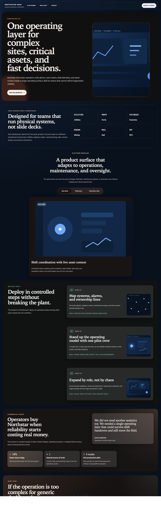
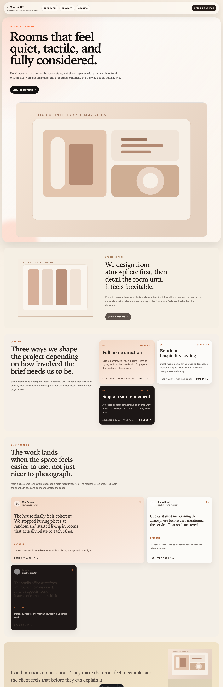
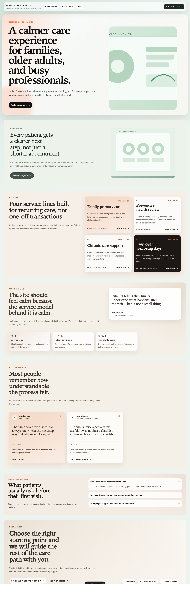
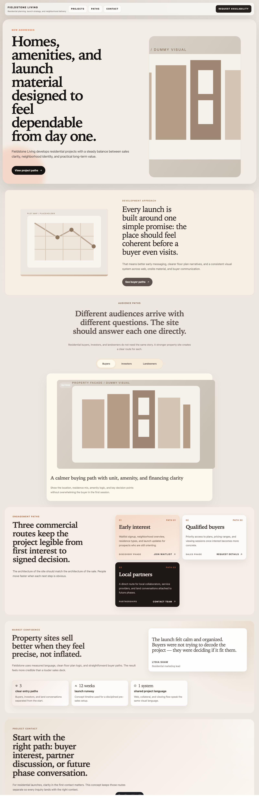
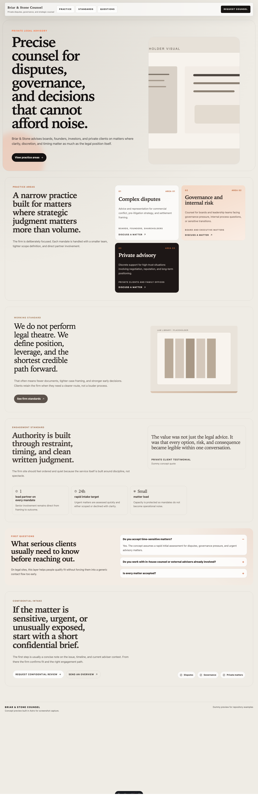
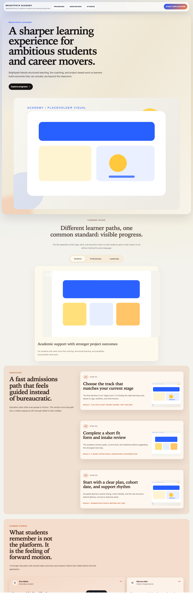
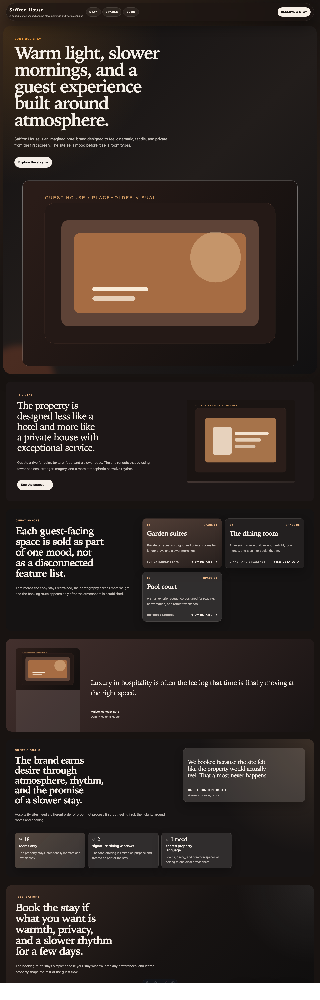
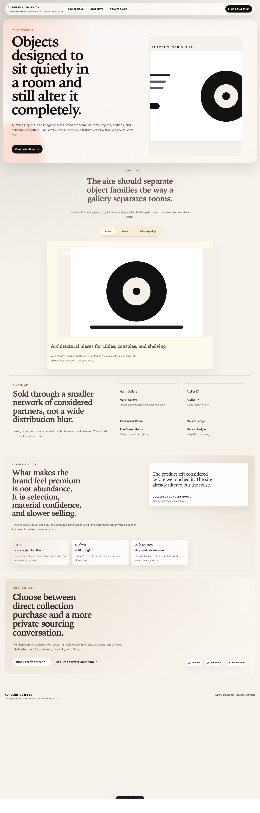

# Astro Claude Skills

Claude Code skills for building high-quality Astro websites from real-world references without falling into generic layouts.

Step-by-step usage guide:

- [docs/quickstart.md](./docs/quickstart.md)
- [docs/usage-guide.md](./docs/usage-guide.md)
- [docs/install-global.md](./docs/install-global.md)

## Included skills

- `astro-site-context`
  Background context for the project structure, capsule system, delivery rules, and page recipes.
- `astro-reference-audit`
  Audits a legacy or mirrored website before implementation.
- `astro-capsule-compose`
  Plans a page or full site using the capsule system before coding.
- `astro-site-build`
  Builds or migrates a premium client site in Astro.
- `astro-site-polish`
  Final pass for responsive quality, metadata, preview behavior, and handoff packaging.

## What this skill set assumes

- Astro is the delivery target.
- Quality matters more than speed.
- Existing structural patterns should be reused before inventing new UI.
- Site-specific sections are allowed when forcing a generic pattern would make the result worse.
- Repeated bespoke sections should later be promoted into the shared capsule library.

## Capsule system

The skill set works with a capsule grammar rather than one-off sections. The current catalog includes patterns such as:

- hero
- feature-pair
- editorial-quote
- join-cta
- logo-cloud
- product-tabs
- proof-strip
- resource-cards
- sticky-steps
- testimonial-stories
- awards-ledger
- bento-grid
- capability-groups
- case-list
- category-roster
- chapter-nav
- director-notes
- featured-work-rail
- gallery-catalog
- manifesto
- metrics-band
- pricing-comparison
- switchboard-panel
- timeline-story

Some patterns may already exist in Astro. Others may be proven in a sibling block library and should be ported only when they materially improve the site.

## Install

Copy the `.claude` folder into your Astro project root:

```bash
cp -R .claude /path/to/your-project/
```

Or merge only the skills you want:

```bash
cp -R .claude/skills/astro-site-build /path/to/your-project/.claude/skills/
```

## Recommended usage order

1. `/astro-reference-audit [source-path-or-url]`
2. `/astro-capsule-compose [site-type-or-page-goal]`
3. `/astro-site-build [client-or-source]`
4. `/astro-site-polish [site-or-route]`

For a full walkthrough, use the step-by-step guide in [`docs/usage-guide.md`](./docs/usage-guide.md).

## Example outputs

The repository also includes screenshot examples generated from local Astro preview routes using invented businesses and dummy media. They are meant to show visual range, not fixed templates.

### First batch

### Northstar Grid

Industrial operations platform with a dark technical language.



### Elm & Ivory

Quiet editorial direction for premium interiors and hospitality.



### HarborCare Clinics

Warm healthcare direction built around clarity and trust.



### Fieldstone Living

Structured residential launch direction for property and development sites.



### Second batch

### Briar & Stone Counsel

Restrained legal advisory direction built around authority, discretion, and trust.



### Brightpath Academy

Brighter education direction built around momentum, admissions, and visible progress.



### Saffron House

Warm hospitality direction built around atmosphere, guest rhythm, and cinematic presentation.



### Aureline Objects

Luxury commerce direction built around edited collections, private sales, and object-led retail.



## Repository layout

```text
astro-claude-skills/
├── .claude/
│   └── skills/
│       ├── astro-site-context/
│       ├── astro-reference-audit/
│       ├── astro-capsule-compose/
│       ├── astro-site-build/
│       └── astro-site-polish/
├── examples/
│   └── screenshots/
├── docs/
│   ├── install-global.md
│   ├── quickstart.md
│   └── usage-guide.md
├── README.md
├── repo-description.txt
└── release-v0.1.0.md
```

## Design principles

- Keep the site authored and premium.
- Preserve original IA, copy, and imagery unless rewriting is explicitly requested.
- Remove plugin clutter and builder artifacts from legacy sources.
- Do not expose internal demos in a client-facing delivery repo.
- Prefer a small number of strong sections over a long stack of average ones.

## Good fit

- premium service websites
- studio portfolios
- product marketing sites
- founder-led company sites
- institutional sites with clear information architecture
- migrations from legacy CMS output into Astro


## License

MIT
